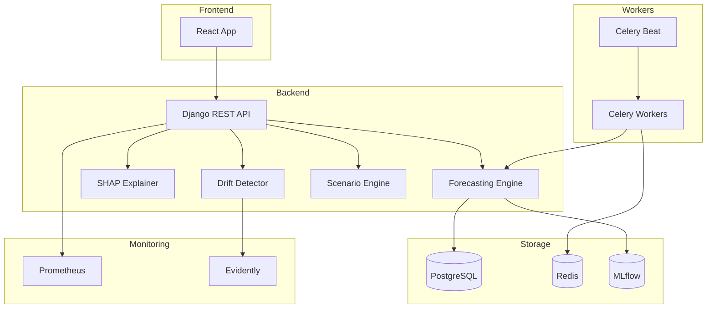

# Intellistock

A forecasting-first inventory system I built to solve a real problem: most inventory dashboards show you what happened, but don't help you figure out what's coming.

Intellistock uses time-series ML (Prophet, ARIMA, Exponential Smoothing) to predict demand, then explains *why* it made those predictions using SHAP. If the model starts degrading, it notices and retrains itself.

<!--  -->

## Why I Built This

I was frustrated with inventory tools that treat forecasting as an afterthought—a single number with no context. I wanted something that would:

1. Pick the right model automatically based on the data (seasonal? trending? noisy?)
2. Show confidence intervals, not just point estimates  
3. Explain predictions in plain English ("demand is up because of weekend effect")
4. Alert me when the model is getting stale

So I built it.

## What's Interesting Here

**Automatic model selection** — The engine analyzes your sales data and picks Prophet (for seasonal data), ARIMA (for trending data), or Exponential Smoothing (for noisy data). Or it ensembles all three if it can't decide. See [`forecasting_engine.py`](backend/forecasting/forecasting_engine.py).

**SHAP explainability** — Every forecast comes with a breakdown of what's pushing demand up or down. Weekend effect? Recent sales spike? It's all there. The waterfall charts make it easy to explain to non-technical stakeholders.

**Drift detection** — Models go stale. Evidently runs nightly checks and flags when input distributions shift. If drift exceeds threshold, Celery kicks off retraining automatically.

**What-if scenarios** — "What happens if we run a 30% off promotion for a week?" The scenario engine simulates it, including the post-promo demand dip most people forget about.

## Quick Start

```bash
# Clone and start everything
git clone https://github.com/aaadnan259/Intellistock.git
cd intellistock
docker-compose up --build

# Frontend: http://localhost:5173
# Backend API: http://localhost:8000
# MLflow UI: http://localhost:5001
```

That's it. Docker handles Postgres, Redis, Celery workers, the whole stack.

### Manual Setup (Dev)

```bash
# Backend
cd backend
python -m venv venv
source venv/bin/activate  # or venv\Scripts\activate on Windows
pip install -r requirements.txt

# Create .env file
cp ../.env.example .env

python manage.py migrate
python manage.py runserver

# Frontend (new terminal)
cd frontend
npm install
npm run dev
```

## Tech Stack

| Layer | Tech | Why |
|-------|------|-----|
| Backend | Django + DRF | Boring and reliable. Great ORM for time-series queries. |
| Frontend | React + Vite + Tailwind | Fast dev experience, looks good without fighting CSS. |
| ML | Prophet, statsmodels, scikit-learn | Prophet handles seasonality well; statsmodels for ARIMA. |
| Explainability | SHAP | Industry standard. TreeExplainer is fast. |
| Monitoring | Evidently, Prometheus | Evidently for drift, Prometheus for everything else. |
| Task Queue | Celery + Redis | Retraining can't block the API. |
| Experiment Tracking | MLflow | Every forecast run is logged. Easy to compare models. |

## Project Structure

```
intellistock/
├── backend/
│   ├── forecasting/          # The interesting stuff
│   │   ├── forecasting_engine.py   # Model selection + training
│   │   ├── explainability.py       # SHAP integration
│   │   ├── drift_detection.py      # Evidently checks
│   │   ├── scenario_engine.py      # What-if simulations
│   │   └── retraining_tasks.py     # Celery jobs
│   ├── inventory/            # Basic CRUD + analytics
│   ├── core/                 # Shared utilities, metrics
│   └── config/               # Django settings, Celery config
├── frontend/
│   └── src/
│       ├── components/       # React components
│       └── services/         # API client
└── docker-compose.yml
```

## Architecture



## API Highlights

```bash
# Get a forecast with confidence intervals
GET /api/forecasting/advanced-predict/
{
  "product_id": 42,
  "days": 30
}

# Understand why the model predicted what it did
GET /api/forecasting/42/explain/

# Check if the model is drifting
GET /api/forecasting/42/drift/

# Simulate a promotion
POST /api/forecasting/scenario/compare/
{
  "product_id": 42,
  "scenarios": [
    {"type": "promotion", "name": "Flash Sale", "parameters": {"intensity": "heavy"}}
  ],
  "forecast_days": 30
}
```

Full API docs at `/api/docs/` when running locally.

## Running Tests

```bash
cd backend
pytest -v                           # All tests
pytest tests/test_forecasting.py    # Just forecasting
pytest -m "not slow"                # Skip slow integration tests
```

Current coverage is around 75%. The ML invariance tests in `test_model_invariance.py` are probably the most interesting—they check that small input noise doesn't cause wild forecast swings.

## Features

### Dashboard
The "Bento Grid" command center. Dark mode (OLED style) with key metrics at a glance.

### Forecasting
Automatic model selection between Prophet, ARIMA, and Exponential Smoothing. Shows confidence intervals and explains predictions.

### Analytics  
- **ABC Analysis**: Which 20% of your items make 80% of your money
- **Slow Movers**: Flags stuff that hasn't sold in 60+ days

### MLOps
- MLflow experiment tracking for every forecast
- Prometheus metrics endpoint (`/metrics/`)
- Evidently drift detection
- Celery beat for scheduled retraining

## Roadmap

- [ ] Anomaly detection for sales spikes
- [ ] Slack alerts when drift is detected
- [ ] Multi-product correlation analysis
- [ ] Cost optimization (holding cost vs stockout cost)

## License

MIT. Do whatever you want with it.

---

Built by [Adnan Ashraf](https://github.com/aaadnan259) — I'm looking for ML/backend roles, feel free to reach out.
